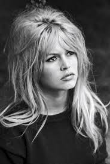

TwistedLife.coffee.md
=====================
<link href="../docs.css" rel="stylesheet"></link>

Brigitte Bardot, French actress and animal rights activist

TwistedLife class
=================

    class TwistedLife extends Life
update function
---------------

      update: ->
        nextGen = @getNextGen()
        twistedNextGen = @twist(nextGen)
        @universe = twistedNextGen

twist function
--------------

      twist: (newGen) ->
An example of list comprehension:

          twisted = (
            for i in [-@radius .. @radius]
              for j in [-@radius .. @radius]
                  absI = Math.abs i
                  absJ = Math.abs j
                  dist = Math.max absI, absJ
                  iOffSet = 0
                  jOffSet = 0
                  if i is 0 and j is 0
                    iOffSet = 0
                    jOffSet = 0
                  else if dist is absI and i < 0 and not (i is -@radius and j is -@radius)
                      iOffSet =  0
                      jOffSet = -1
                  else if dist is absJ and j > 0
                      iOffSet = -1
                      jOffSet =  0
                  else if dist is absI and i > 0
                      iOffSet = 0
                      jOffSet = 1
                  else
                    iOffSet = 1
                    jOffSet = 0
                  x = ((i + @radius + iOffSet) + @sideLen) % @sideLen
                  y = ((j + @radius + jOffSet) + @sideLen) % @sideLen
                  newGen[x][y])

          twisted

render function
---------------

      render: (gfx) ->
        for y in [0 ... @sideLen]
          for x in [0 ... @sideLen]
            if @universe[y][x] is 1
              gfx.drawSquare(y, x, @size)
            else
              gfx.drawSquare(y, x, @size, "black")
